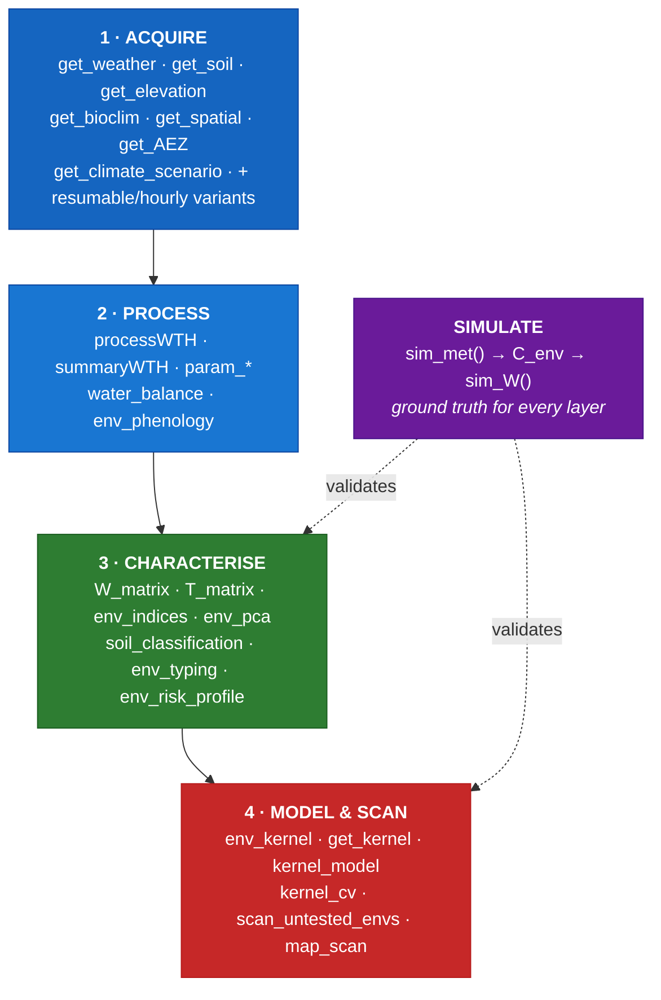
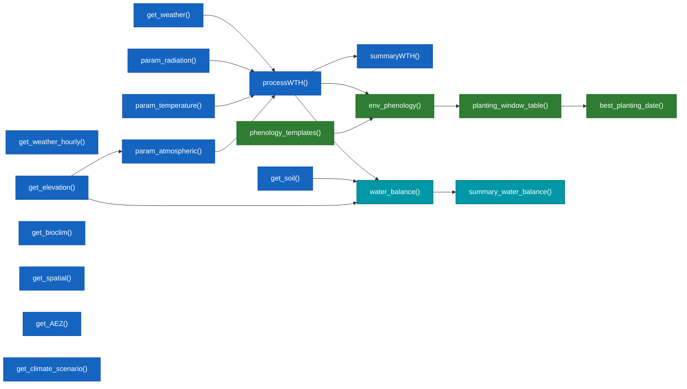
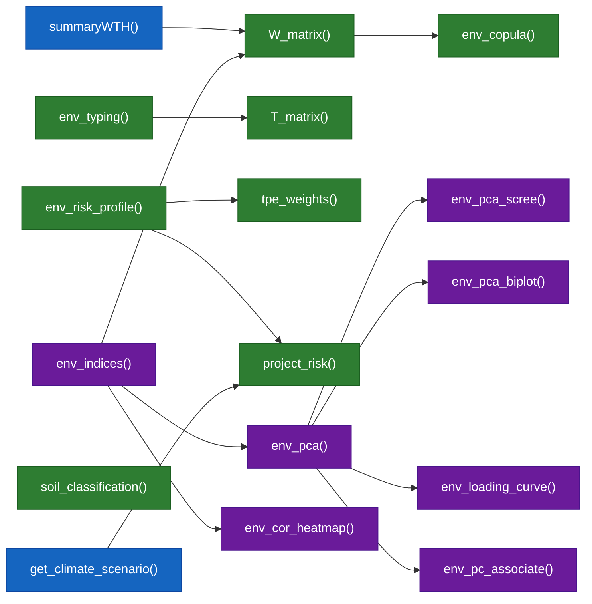
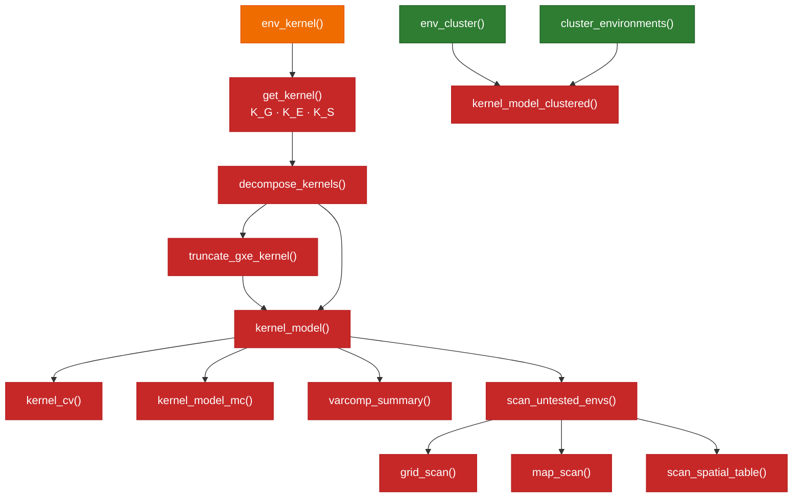
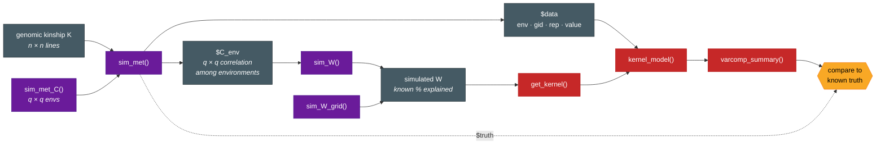

# EnvRtype 

### Envirotyping for Quantitative Genetics and Plant Breeding

**EnvRtype** is an R package for **enviromics** — the study of the *envirome*, the set of
environmental conditions linked to the biological performance of living beings. It collects
worldwide daily weather and soil data, derives agro-meteorological parameters, builds
environmental covariable matrices and relatedness kernels, mines environmental typologies,
delineates soil zones with Gaussian mixture models, and runs a FAO-56 soil water balance for
use in enviromics and genotype-by-environment (GxE) analyses.

This is a fully re-engineered successor to the original
[EnvRtype (allogamous/EnvRtype, 2021)](https://github.com/allogamous/EnvRtype), extending it
from a weather-typing toolbox into an end-to-end envirotyping, simulation and prediction
framework.

---

## Installation

```r
if (!require("devtools")) install.packages("devtools")
devtools::install_github("gcostaneto/EnvRtype")
```

```r
library(EnvRtype)
```

---

## What's new compared to the original EnvRtype (2021)

The original [EnvRtype](https://github.com/allogamous/EnvRtype) (Costa-Neto et al., 2021,
*G3*) focused on collecting NASA POWER weather data, computing environmental typologies
and building environmental kernels for reaction-norm models. This version keeps that workflow and
adds several new layers:

| Area | Original EnvRtype (2021) | EnvRtype (this version) |
|------|--------------------------|-------------------------|
| **Weather data** | `get_weather()` (NASA POWER, daily) | `get_weather()` + hourly (`get_weather_hourly()`) and **resumable / restartable** downloads (`get_weather_resumable()`, `read_progress_log()`, `restart_from_log()`) |
| **Soil data** | — | `get_soil()`, `get_soil_resumable()`, `soil_classification()` (Gaussian-mixture soil zoning) |
| **Other geodata** | — | `get_elevation()`, `get_bioclim()`, `get_spatial()`, `get_AEZ()`, `get_climate_scenario()` |
| **Processing** | `processWTH()`, `param_temperature/radiation/atmospheric()`, `summaryWTH()` | Same, plus a full **FAO-56 water balance** (`water_balance()`, `summary_water_balance()`) and **phenology** (`env_phenology()`, `phenology_templates()`, `planting_window_table()`, `best_planting_date()`) |
| **Characterisation** | `W_matrix()`, `env_typing()` | Adds `T_matrix()`, `env_indices()`, a full **PCA suite** (`env_pca()`, `env_pca_biplot()`, `env_pca_scree()`, `env_loading_curve()`, `env_pc_associate()`), correlation tools (`env_cor()`, `env_cor_heatmap()`) and coverage/target diagnostics |
| **Risk & TPE** | — | `env_risk_profile()`, `env_copula()`, `tpe_weights()`, `project_risk()`, `env_target_importance()` |
| **Kernels** | `env_kernel()`, `get_kernel()` | Adds `decompose_kernels()`, `undecompose_kernels()`, `truncate_gxe_kernel()` and a soil kernel path in `get_kernel()` |
| **Modelling** | `kernel_model()` | Adds `kernel_cv()`, `kernel_model_clustered()`, `kernel_model_mc()`, `varcomp_summary()`, environment clustering (`env_cluster()`, `cluster_environments()`) |
| **Untested environments** | — | `scan_untested_envs()`, `grid_scan()`, `map_scan()`, `scan_spatial_table()` |
| **Simulation** | — | Ground-truth simulator: `sim_met()`, `sim_met_C()`, `sim_W()`, `sim_W_grid()` to validate every layer against a known truth |
| **License** | MIT | GPL-3 (CRAN-ready) |

---

## Package modules & workflow

The package is organised in five layers, plus a simulation engine that generates ground-truth
data to validate each layer.

### Overview — the five layers



### 1–2 · Data acquisition and processing



### 3 · Characterisation and dissection



### 4 · Prediction and scanning



### Simulation — closing the validation loop



---

## Acknowledgements

### Original EnvRtype team (2020–2021)

EnvRtype began in 2020 and was first published as
[allogamous/EnvRtype](https://github.com/allogamous/EnvRtype) in Costa-Neto, G., Galli, G.,
Carvalho, H. F., Crossa, J., & Fritsche-Neto, R. (2021).
*EnvRtype: a software to interplay enviromics and quantitative genomics in agriculture.*
**G3: Genes|Genomes|Genetics**, 11(4), jkab040. We gratefully acknowledge the original authors
and the community of users whose feedback shaped this new version.

### Current maintainers and developers

- **Germano Costa-Neto** — maintainer & lead developer &lt;germano.cneto@gmail.com&gt;
- **Fernanda Pontes** — developer &lt;ferpoontes@gmail.com&gt;

---

## Citation

```r
citation("EnvRtype")
```

Please cite the package when using it in publications, and kindly let the maintainer know when
you are using EnvRtype (contact **germano.cneto@gmail.com**).

---

## License

Released under the **GPL-3** license — free and open source. You may use, study, modify and
redistribute the code, provided derivative works remain under the same terms.
